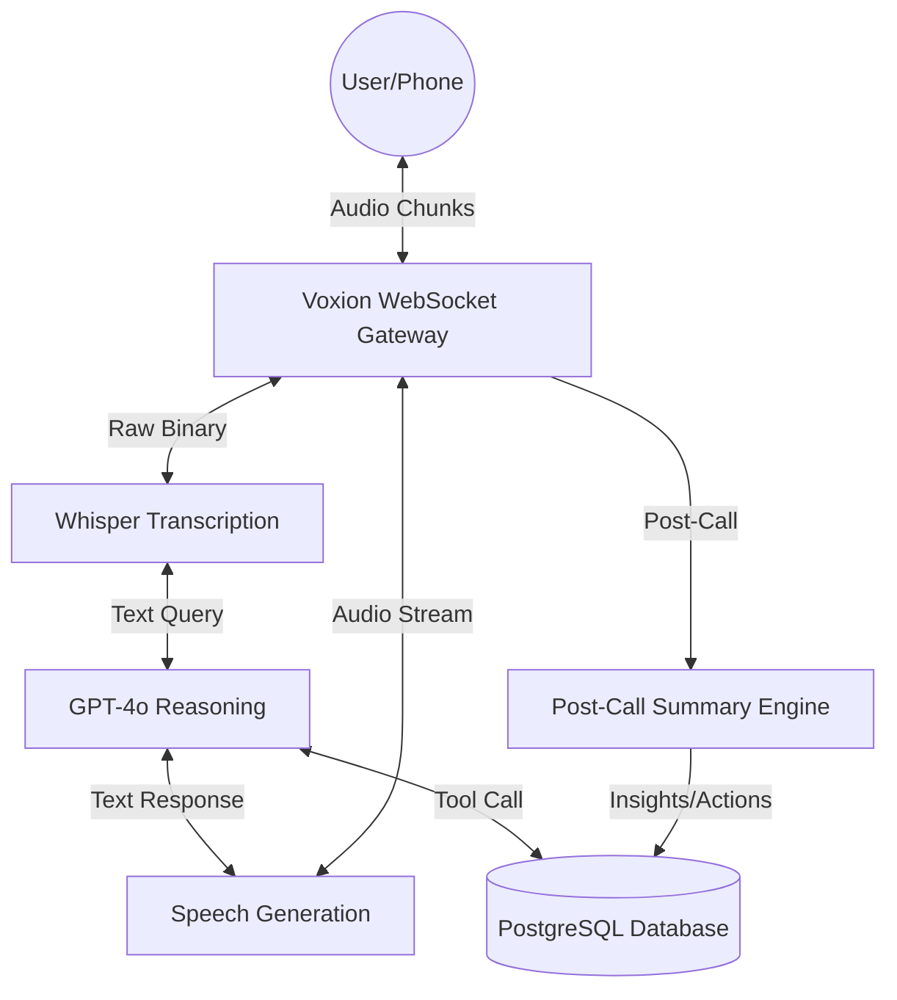

# 🛠️ Voxion Technical Design Document

## 1. Executive Summary
**Voxion** is a high-performance, sub-second latency Voice AI Infrastructure designed for automated customer support and personal assistant logic. The architecture is built as a **Monorepo** to ensure extreme consistency between the real-time AI engine (Backend) and the diagnostic console (Frontend).

---

## 2. Technical Stack (The "Voxion Core")

| Layer | Technology | Rationale |
| :--- | :--- | :--- |
| **Monorepo Engine** | **Turborepo** | Enables sharing of types and logic between `apps/` and `packages/` with high-performance caching. |
| **Backend Framework** | **NestJS (Node.js)** | Chosen for its enterprise-grade modularity, Dependency Injection, and native support for WebSockets (Gateways). |
| **Frontend Framework** | **Next.js 15 (App Router)** | Industry-standard for SEO, fast rendering, and optimized Client Side Components for the diagnostic console. |
| **Real-time Comms** | **Socket.io** | Provides bi-directional, persistent connection between the user's mic and the AI logic. |
| **STT Engine** | **OpenAI Whisper-1** | High-fidelity transcription even with accents (e.g., Indian English) and background noise. |
| **Reasoning Engine** | **GPT-4o (Omni)** | Chosen for its ultra-fast reasoning and multimodal capability for future Voice-to-Voice latency reduction. |
| **TTS Engine** | **OpenAI TTS-1-HD** | Generates human-like, expressive speech with multiple professional profiles (Alloy, Aria, etc). |
| **Persistence** | **PostgreSQL + Drizzle ORM** | Type-safe database interactions and extremely fast migrations compared to traditional ORMs. |

---

## 3. System Architecture

### High-Level Data Flow

---

## 4. Key Design Patterns

### ⚡ Sub-Second Latency Pipeline
Traditional AI voice systems wait for the entire sentence to finish. **Voxion** uses a **Streaming Buffer Strategy**:
1.  **1s Segments**: Microphone audio is captured in 1-second bursts.
2.  **Streaming TTS**: The AI starts generating the response audio before the full text is even finished (future phase).
3.  **Diagnostic HUD**: Every interaction sends a "Round Trip Time" (RTT) pulse to the dashboard to monitor network health.

### 🧩 Plugin-Based Tool Calling
Voxion is designed to "Act", not just "Talk". Through NestJS Services, we can plug in:
*   **CRM Tool**: Sync call logs directly to Salesforce/Zoho.
*   **Action Engine**: Automatically extract tasks and register them in the `Follow-ups` table.

---

## 5. Rationale: Why this Architecture?

### Why NestJS and not Express?
For low-level prototypes, Express is fine. For **Voxion**, we chose NestJS because it forces architectural discipline. Adding a "New CRM Integration" simply means creating a new `crm.service.ts` and injecting it into the `CallModule`.

### Why WebSockets and not HTTP?
Voice is a continuous stream. HTTP request-response cycles add a overhead of 200ms-400ms per turn. WebSockets reduce this "Negotiation Time" to near-zero once the connection is open.

### Why OpenAI TTS over ElevenLabs?
While ElevenLabs sounds slightly better, **OpenAI TTS is 2-4x faster** in terms of Time-to-First-Byte (TTFB). For a "Live Conversation", speed is more important than perfect prosody.

---

## 6. Implementation & Usage
### Deployment
*   **Backend**: Render/Railway for persistent WebSocket nodes.
*   **Frontend**: Vercel for the diagnostic console and landing page.

### Expansion
To add a new customer support model, developers simply extend the `CallGateway` by adding a new `Tool` definition in `AiCallService`.

---

**Voxion is built to be the "Nervous System" for AI Voice automation.**
